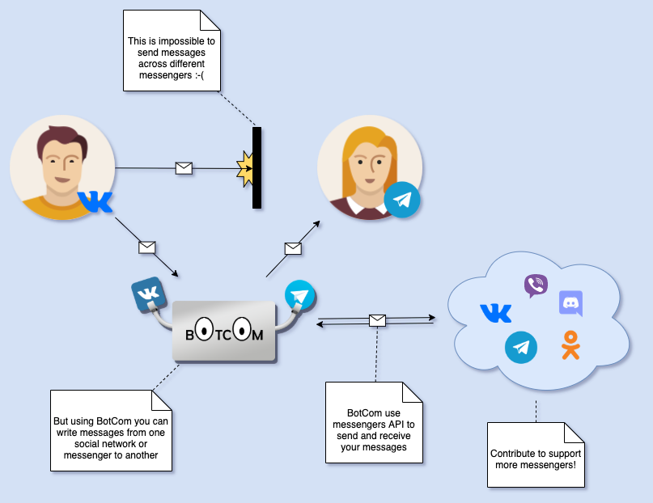

# BotCom

### Problem
Did you ever had problems having accounts in many social networks and messengers?

What do you feel when you need to switch between accounts to write to other people often?

Had you ever created account in specific messenger to chat with only one receiver
because they don't have account in other messengers?

Why do you need to switch between different messengers?

Why you can't have all your companions in one place?

Well, there is solution for this...

### Description
**BotCom** is a system of bots that allows you to write from current messenger to another messengers
without needing to create account in these another messengers.

Your messages are not stored in database.
We are not going to read your dialogs with bots.

List of available commands:

  `/MESSENGER ID` -- connect to user `ID` from `MESSENGER`, where
    `MESSENGER` is messenger or social network name (`vk`, `telegram`, `viber` etc)
    `ID` is an identifier of a friend in specified messenger or social network
  Examples:
    `/telegram superkitty`
    `/vk 177482059`

  `/off` -- disconnect from current dialog

  `/lang LANGUAGE` -- change language to `LANGUAGE`
  Example: `/lang en`

  `/unreg` -- delete your BotCom account

  `/help` -- print this message

But you also can use button instead of commands
without needing to write them by yourself.

### Example
 To create an account simply write a message to bot
 or press `Start` button.
 
**YOU**: `Hello I want to speak to another messenger`  
**BOT**: `Hooray!
  Your BotCom account is activated! Now you can send and receive messages!
  BotCom helps send messages across different messengers and social networks.
  Currently only text messages are supported for vk and telegram.
  For more information send /help`

 To speak with your friend from `MESSENGER` you can use buttons
 or command `/MESSENGER ID`.
 For example,
 if your friend is in `telegram` messenger and his `ID` is `friend777`
 you need to write `telegram friend777` command.
 Note: your friend must be registered in BotCom too.
 Each BotCom account from other messenger is a different account.

**YOU**: `/telegram friend777`  
**BOT**: `Waiting for connection from friend777 from telegram`

 After this `friend777` will receive message about your request.
 For example, you are writing from `vk` having `ID` = `superkitty` 
 
**BOT**: `superkitty  from vk is trying to contact you.
  To start a conversation
  send /vk superkitty
  or select superkitty from vk using "Dialogs" button`

 In order to start a dialog, friend777 should send this message or use buttons

**FRIEND777**: `/vk superkitty`

 After that you and friend777 both will receive message about successful connection

**BOT**: `Connected with friend777!`
(to you)

**BOT**: `Connected with superkitty!`
(to friend777)

 At this state all message you send will be received by your companion.
